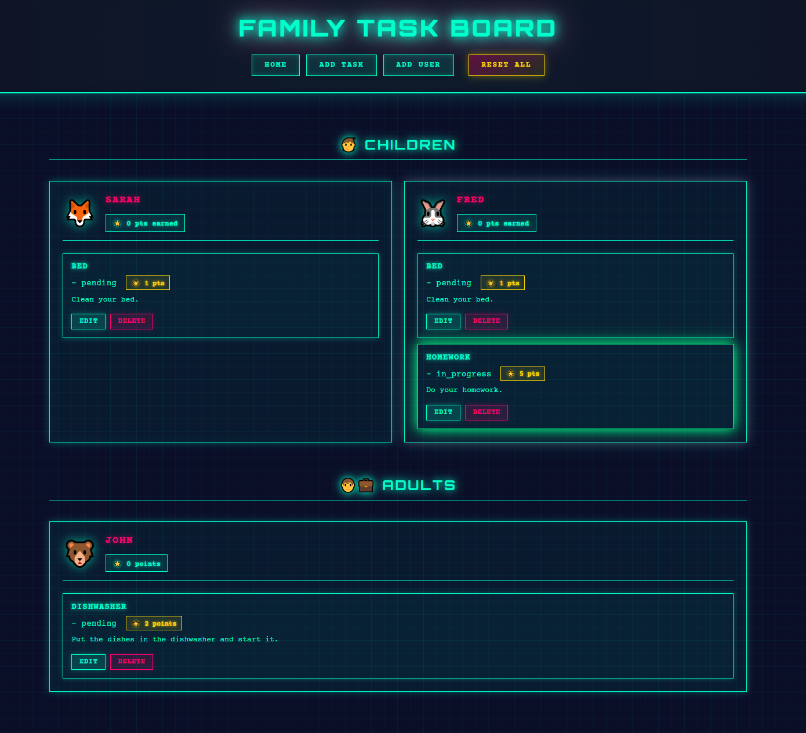

# home-automation

- [About](#about-this-project)
- [Apps](#apps)
    - [Task Board](#task-board)
- [Requirements](#requirements)
    - [Run requirements](#run-requirements)
    - [Dev requirements](#dev-requirements)

# About this project

I have started this project to learn AI usage aimed to building a simple applications.

# Apps

## Task Board

Simple GUI app to manage home tasks (tasks creation, assignment, realization, etc.).
Users may get points for tasks finalization.



# Requirements

## Run requirements

- `python3` and `virtualenv` (the app is being run in the `virtualenv`)

To setup the run requirements run:

```bash
make setup-env
```

## Dev requirements

All the [run requirements](#run-requirements) plus:

- `pre-commit`

To setup the dev requirements run:

```bash
make setup-dev
```
